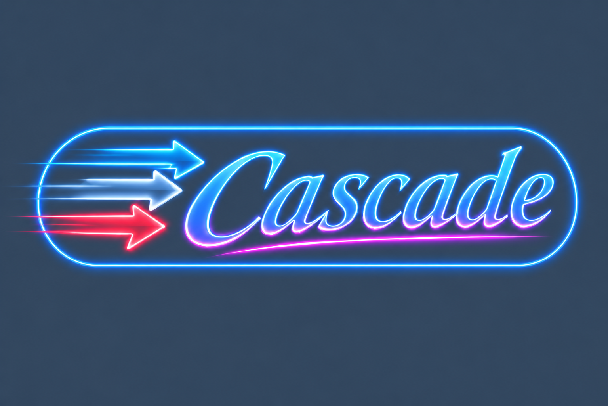

# Liquefy

A home for two generations of a reactive, JavaScript-first front end
framework: **Cascade**, and **Flow** before it.

**[Try the demo](https://erobwen.github.io/liquefy/cascade/)** - every page has a
button showing its own code. (And [Flow's demo](https://erobwen.github.io/liquefy/flow/) - both
from [erobwen.github.io/liquefy](https://erobwen.github.io/liquefy/).)

## Cascade

A reactive front end framework with an integrated state management system,
built on the world's first **temporal signals**.

Signals usually give you one value per object and property, so every
intermediate result needs a signal of its own. But rendering is a sequence
of steps transforming the same objects. With temporal signals, readers and
writers of the same data are ordered in time: a reader sees the value as of
its place in the pipeline, and a change invalidates only what comes after
it. So Cascade renders directly onto the live DOM in one pass, in tree order
- a parent can render, measure the room it has, and hand that down to its
children, in the same pass - while a rebuild still touches only the nodes
that actually changed.

- **Programmatic, reactive layout** driven by real DOM measurement, not CSS
  media queries.
- **Transition animations** - elements moving, resizing, appearing and
  leaving - with no changes to the components animated.
- **Stable identity and state** across rebuilds, and components that keep
  their state and elements while they aren't shown.
- **Service locators throughout**: themes that replace whole components at
  runtime - and are their colors too, all made from a base and an accent.
- **Portals, routing, hydration** (a UI written as plain data), and
  **JavaScript first** - no JSX, no CSS files.

| Package | |
|---|---|
| [@liquefy/cascade.reactive](cascade.reactive#readme) | Temporal signals - the reactive engine |
| [@liquefy/cascade.component](cascade.component#readme) | The component model |
| [@liquefy/cascade.dom](cascade.DOM#readme) | Rendering in the browser, measurement, animation, routing |
| [@liquefy/cascade.ui](cascade.ui#readme) | Themed widgets, layout, overlays, color schemes - and the basic theme |
| [@liquefy/cascade.ui.material](cascade.ui.material#readme) | A Material Design theme, on mdui 2 |

```console
npm install @liquefy/cascade.ui @liquefy/cascade.dom @liquefy/cascade.component @liquefy/cascade.reactive
```

```js
import { Component, RenderContext, CompoundServiceLocator } from "@liquefy/cascade.component";
import { DOMElementTarget, DOMServiceLocator, div, h1, p, text } from "@liquefy/cascade.dom";
import { button, basicTheme } from "@liquefy/cascade.ui";

class Hello extends Component {
  setProperties({ to }) {
    this.to = to;
  }

  initializeState() {
    return { count: 0 };
  }

  build() {
    return div(
      { key: "hello", style: { padding: "20px" } },
      h1({ key: "title" }, text({ key: "titleText", text: "Hello " + this.to })),
      p({ key: "count" }, text({ key: "countText", text: "Clicked " + this.count + " times" })),
      button({ key: "click" }, text({ key: "clickText", text: "Click me!" }), () => { this.count++; }),
    );
  }
}

const services = new CompoundServiceLocator(new DOMServiceLocator(), basicTheme);
new Hello({ to: "World" }).renderOnto(
  new RenderContext(DOMElementTarget.forElement(document.getElementById("app")), { serviceLocator: services }),
);
```

## Flow

The generation before Cascade. Flow is what you get if you take all the
capabilities of MobX + React and integrate them into one unit: components
that build reactively, auto-observed state, minimal DOM updates and
transition animations. It has no temporal signals - and none of their
overhead: for context free UIs, built context free, it's a simpler machine.
[Try its demo](https://erobwen.github.io/liquefy/flow/).

| Package | |
|---|---|
| [@liquefy/causality](causality#readme) | The reactive engine (ES6 proxies, like MobX) |
| [@liquefy/flow.core](flow.core#readme) | The component model |
| [@liquefy/flow.dom](flow.DOM#readme) | Rendering in the browser, and animations |
| [@liquefy/basic-ui](flow.ui/basic#readme) | Basic widgets and layout |
| [@liquefy/themed-ui](flow.ui/themed#readme) | Themed widgets |
| [@liquefy/ui-material](flow.ui/material#readme) | A Material Design theme, on mdui 2 |

## Development

This is a monorepo of npm workspaces - one install, at the root, links every
package to the others:

```console
npm install
npm test            # every package's tests
npm run demo        # the Cascade demo, at http://localhost:5173
npm run flow:demo   # the Flow demo
npm run build:site  # both demos, as deployed to GitHub Pages - see .github/workflows
```

This repository is a more mature version of the experiments in
[reactive-flow](https://github.com/erobwen/reactive-flow).

## License

ISC - see [LICENSE](LICENSE).
